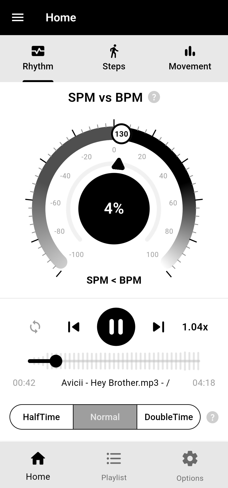
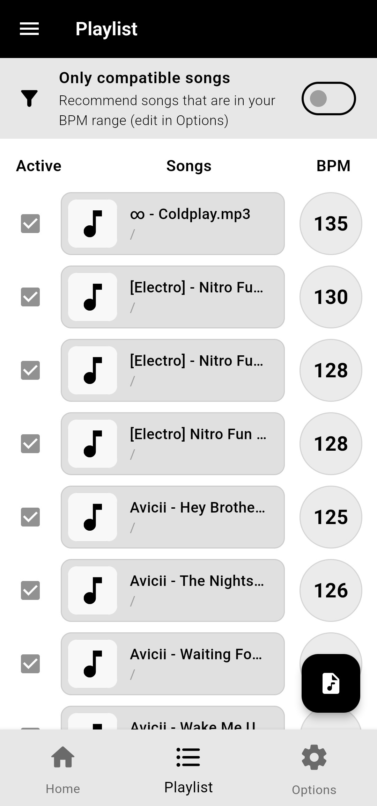
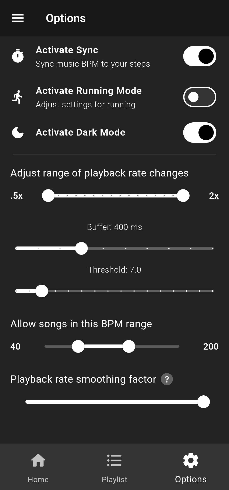

# BeatStride - A music-based pedometer

A Flutter open source mobile app that synchronizes the music rhythm (BPM) to the the steps of the user (SPM).

## Screenshots
| Screenshot 1 | Screenshot 2 | Screenshot 2 |
|--------------|--------------|--------------|
|  |  |  |

## Features Checklist

- [x] Import songs locally to create a playlist
- [x] Play, loop, go to previous and skip songs
- [x] Visualize SPM vs BPM synchronization
- [x] Detect and count steps and calculate step frequency (SPM)
- [x] Visualize accelerometer data
- [x] Change speed dynamically based on SPM
- [x] Play songs at double-time or half-time
- [x] Modify the adaptive playback rate algorithm to your needs with several options
- [x] Read explanations for complex settings in tooltips
- [x] Dark mode
- [ ] Connect and play songs through external music streaming platforms (Spotify, Apple Music, YouTube Music), supporting adaptive audio playback rate
- [ ] Easily install from Play Store and App Store
- [ ] Detect song BPM automatically
- [ ] Detect song sections with free time or with different tempo
- [ ] Compensate delay with SPM-BPM phase sync
- [ ] Dynamically change playlist songs based on current SPM
- [ ] Change double-time or half-time mode automatically
- [ ] Control the audio player with headphone buttons
- [ ] Change app theme

## Supported platforms

BeatStride has currently been tested on Android 13. It has not been tested on iOS yet but it's going to be officially supported soon. The app heavily relies on the accelerometer sensor and portability aspect of the device it's running on, so desktop OSs are not supported.

| Platform    | Support status |
|-------------|----------------|
| Android     | ✔️              |
| iOS         | ❔              |
| Windows     | ❌              |
| Linux       | ❌              |
| MacOS       | ❌              |

## License

The source code of this project is licensed under the [Apache License 2.0](https://choosealicense.com/licenses/apache-2.0/).
